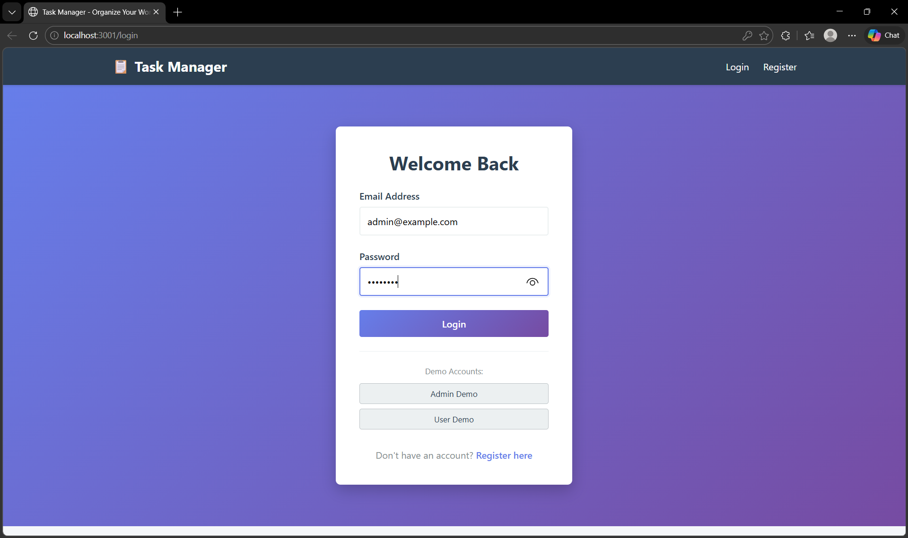
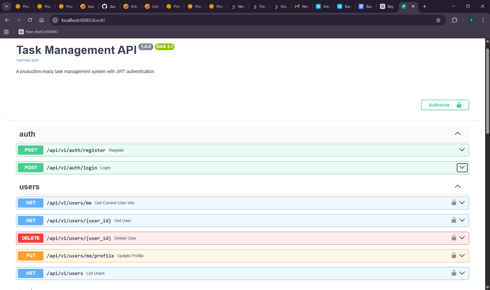

# 🚀 Task Management — Full-Stack Application

A production-ready full-stack task management system built with **FastAPI** and **React**, featuring secure JWT authentication, role-based access control, and Dockerized deployment.

---

## ✨ Features

* 🔐 JWT Authentication (Register/Login)
* 👥 Role-Based Access Control (User / Admin)
* 📋 Task CRUD Operations (Create, Read, Update, Delete)
* ⚡ FastAPI with interactive Swagger documentation
* 📊 Pagination & Filtering support
* 🛡️ Input validation & global error handling
* 🐳 Dockerized setup (Backend + Frontend + PostgreSQL)
* 🔄 RESTful API design with versioning (`/api/v1`)

---

## 📸 Screenshots

### 🔐 Login Page




### 📄 Swagger API Documentation



> 📌 Add your screenshots inside a `screenshots/` folder in your repository.

---

## 🛠️ Tech Stack

### Backend

* FastAPI
* SQLAlchemy ORM
* PostgreSQL / SQLite
* JWT (python-jose)
* Passlib (bcrypt)

### Frontend

* React.js (Hooks)
* Axios

### DevOps

* Docker & Docker Compose

---

## 🏗️ Architecture

This project follows a **modular monolithic architecture**:

* Backend structured into layers: routes, services, models, schemas
* Frontend built with reusable React components
* Database managed via SQLAlchemy ORM

The design ensures maintainability and allows easy transition into microservices if required.

---

## 📈 Scalability

* Modular structure allows separation into microservices
* Docker enables containerized deployment
* Load balancing can be added using Nginx
* Redis can be introduced for caching
* Horizontal scaling using Kubernetes

---

## 🚀 Quick Start (Local Setup)

### 🔧 Backend

```bash
cd backend
python -m venv venv

# Windows
venv\Scripts\activate

# macOS/Linux
# source venv/bin/activate

copy .env.example .env
pip install -r requirements.txt

# Initialize database with sample data
python -c "from app.db.init_db import init_db; init_db()"

# Run server
uvicorn app.main:app --reload --host 0.0.0.0 --port 8000
```

### Backend URLs

* API: http://localhost:8000
* Swagger: http://localhost:8000/docs
* Health: http://localhost:8000/health

---

### 💻 Frontend

```bash
cd frontend
copy .env.example .env
npm install
npm start
```

Frontend runs at:
👉 http://localhost:3000

---

## 🐳 Run with Docker

```bash
docker compose up --build
```

### Services:

* Backend → http://localhost:8000
* Frontend → http://localhost:3000
* PostgreSQL → localhost:5432

---

## 📡 API Endpoints

### 🔐 Authentication

* POST `/api/v1/auth/register`
* POST `/api/v1/auth/login`

### 👤 Users

* GET `/api/v1/users/me`
* GET `/api/v1/users/{id}` (Admin only)

### 📋 Tasks

* GET `/api/v1/tasks`
* POST `/api/v1/tasks`
* PUT `/api/v1/tasks/{id}`
* DELETE `/api/v1/tasks/{id}`

---

## 🔑 Authentication

Use JWT token in header:

```http
Authorization: Bearer <access_token>
```

---

## 👥 Sample Users

| Role  | Email                                         | Password |
| ----- | --------------------------------------------- | -------- |
| Admin | [admin@example.com](mailto:admin@example.com) | admin123 |
| User  | [user@example.com](mailto:user@example.com)   | user123  |

---

## ⚙️ Environment Configuration

Update `.env` file:

```
DATABASE_URL=sqlite:///./test.db
SECRET_KEY=your-secret-key
ACCESS_TOKEN_EXPIRE_MINUTES=30
```

---

## 📬 Postman Collection

Import `POSTMAN_COLLECTION.json` to test APIs easily.

---

## 📌 Notes

* Ensure backend is running before starting frontend
* Update `REACT_APP_API_URL` if backend URL changes
* Change secrets before production deployment

---

## 📄 License

This project is open-source and free to use for educational and personal projects.
